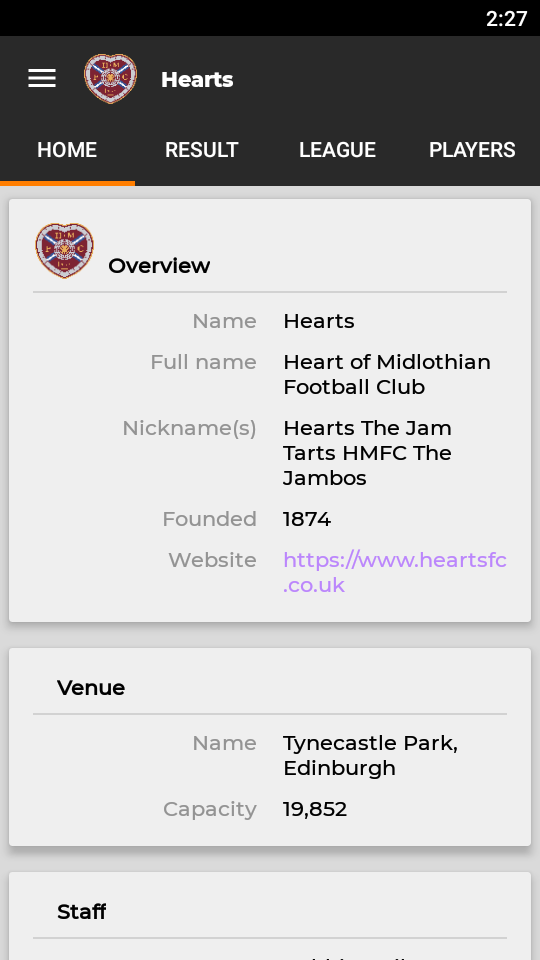
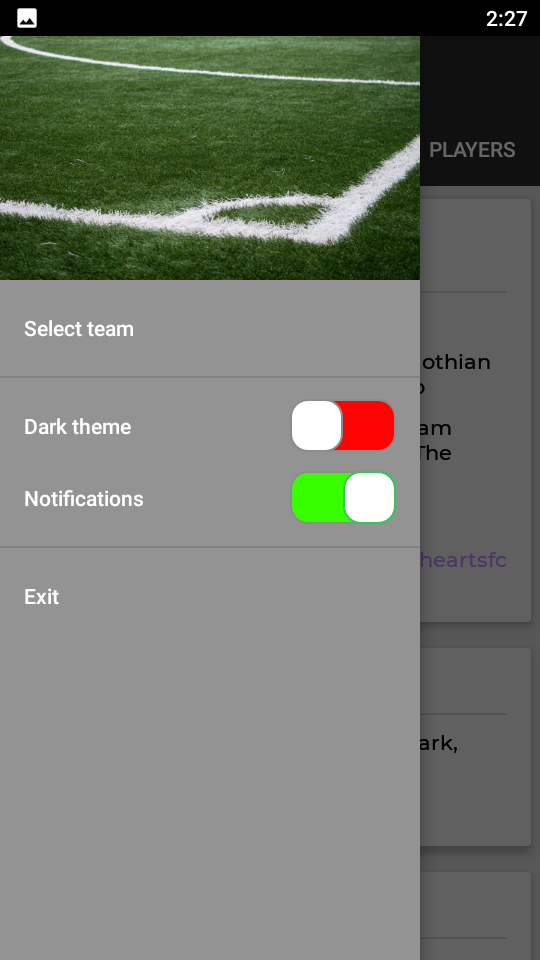
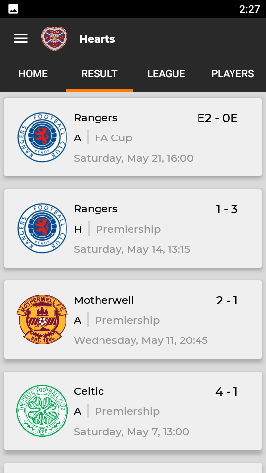
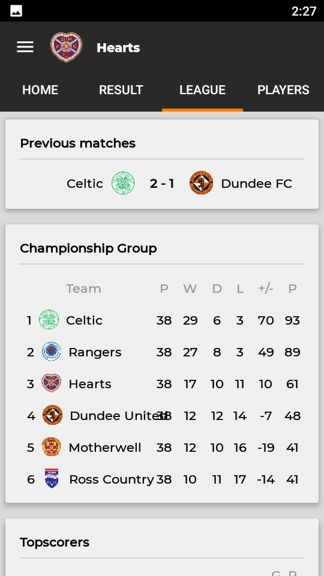
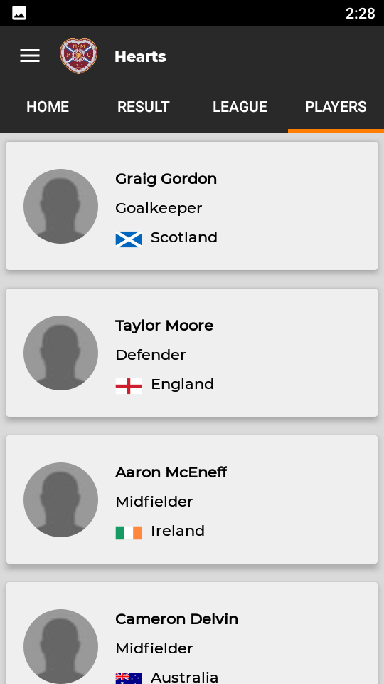

# Football News

## 📜 &nbsp;Description app:

Extended statistics for several football clubs.

## 🛠 &nbsp;Tech Stack

* Kotlin
* MVVM
* XML
* Navigation component with navigation graph
* LiveData
* Kotlin Coroutines
* Retrofit
* OkHTTP logging
* Gson
* Binding delegate
* Hilt
* Coil

## 📸 &nbsp;Screenshots

     
